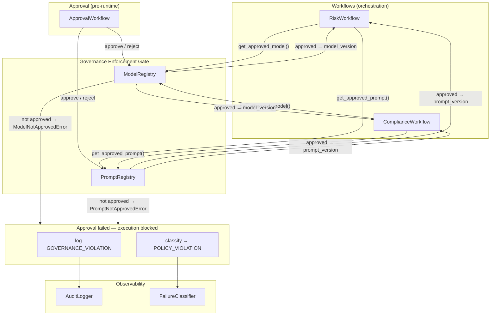

# Governance Enforcement — Runtime Model and Prompt Approval

This document describes how the AI Risk Engine enforces model and prompt approval at runtime: workflows call the registries for approved assets only, and unapproved use is blocked, logged, and classified.

---

## Runtime Enforcement Diagram

**Flow summary:**

1. **Workflows** (`RiskWorkflow`, `ComplianceWorkflow`) resolve model and prompt versions at run start via `_resolve_versions()`, which calls `ModelRegistry.get_approved_model(...)` and `PromptRegistry.get_approved_prompt(...)` when registries are injected.
2. **Governance Enforcement Gate:** The registries act as the gate. `get_approved_model()` and `get_approved_prompt()` return only approved records; otherwise they raise `ModelNotApprovedError` or `PromptNotApprovedError`.
3. **If approval fails:** Execution is blocked (exception propagates; no fallback). The workflow catches the exception, logs a **GOVERNANCE_VIOLATION** event via **AuditLogger**, then re-raises. Any outer exception handler can use **FailureClassifier** to classify the failure as **POLICY_VIOLATION** for metrics and alerting.
4. **ApprovalWorkflow** is the pre-runtime process (human-in-the-loop, RBAC) that approves or rejects models and prompts; the registries store approval state used at runtime.

---

## Before enforcement

- Workflows used `get_model()` / `get_prompt()`, which could return unapproved or missing assets.
- Exceptions were caught and replaced with a default version (e.g. `simulated@1`), so unapproved models and prompts could still run.
- No guarantee that only approved assets were used; audit trail did not consistently reflect governance violations.

---

## After enforcement

- Workflows use **`get_approved_model()`** and **`get_approved_prompt()`** when registries are injected. Only approved, deployable model records and approved prompt records are returned.
- **If the model or prompt is not approved or not found:** the registry raises `ModelNotApprovedError` or `PromptNotApprovedError`. There is no fallback; execution fails before any workflow nodes run.
- On catch, the workflow logs a **GOVERNANCE_VIOLATION** audit event (actor=system, resource_type, resource_id, reason, correlation_id, metadata) and re-raises.
- **FailureClassifier** maps these exceptions to **POLICY_VIOLATION**, so metrics and monitoring can treat them as policy violations.
- When no registry is injected (e.g. tests or environments without governance), workflows still use default versions and do not call the registries.

---

## Why this matters for enterprise AI governance

- **Policy enforcement:** Only approved models and prompts can be used at runtime; approval is enforced in code, not only in process.
- **Auditability:** Every attempted use of an unapproved asset produces an immutable **GOVERNANCE_VIOLATION** audit record with correlation_id and reason, supporting compliance and forensics.
- **Observability:** Failures are classified as **POLICY_VIOLATION**, enabling dashboards and alerts on governance violations and consistent handling with other policy-related failures.
- **Clear boundary:** The enforcement gate lives in the governance layer (registries); workflows depend on registry interfaces and do not bypass approval checks.
