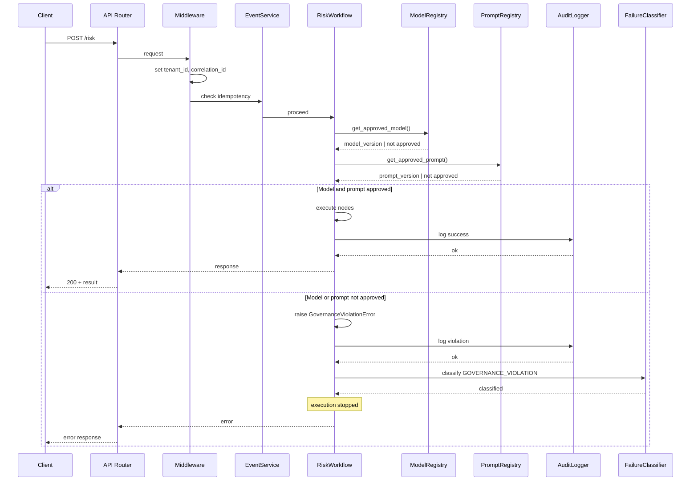

# Governance Enforcement — Runtime Sequence

This document describes the runtime request flow for risk evaluation, including middleware, idempotency, model/prompt resolution, and the success vs. governance-violation branches.

---

## Sequence Diagram

---

## Runtime Enforcement Guarantees

- **Request context**: Middleware establishes `tenant_id` and `correlation_id` on every request so all downstream steps and audit entries are attributable and traceable.

- **Idempotency**: EventService performs an idempotency check before workflow execution so duplicate requests can be detected and handled consistently.

- **Approval gate**: RiskWorkflow does not run model or prompt logic until both `get_approved_model()` and `get_approved_prompt()` succeed. Unapproved assets cause a governance violation path; no fallback to unapproved models or prompts occurs.

- **Violation path**: When model or prompt is not approved, a `GovernanceViolationError` is raised, the event is logged by AuditLogger, FailureClassifier marks it as `GOVERNANCE_VIOLATION`, and execution stops before any model invocation. The client receives an error response; no partial or ungoverned execution is returned.

- **Audit**: Both success and violation flows write to AuditLogger, so all risk requests and governance outcomes are auditable for compliance and debugging.
